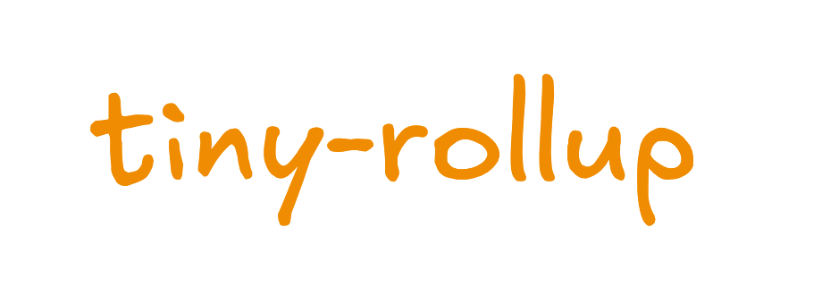

# tiny-rollup [](https://npmjs.com/package/tiny-rollup)

[![npm version][npm-version-src]][npm-version-href]
[![npm downloads][npm-downloads-src]][npm-downloads-href]
[![bundle][bundle-src]][bundle-href]
[![JSDocs][jsdocs-src]][jsdocs-href]
[![License][license-src]][license-href]

English | <a href="./README-zh_CN.md">简体中文</a>



tiny-rollup is a lightweight and efficient JavaScript bundler designed for rapid construction and packaging of modern web applications. With its simple yet powerful workflow, tiny-rollup is dedicated to providing optimal performance and development experience.

## Features

📦️ Lightweight: tiny-rollup focuses on minimizing the size of the bundling tool, ensuring fast startup and loading times.

🔧 Simple Configuration: Provides concise and intuitive configuration options, allowing for easy customization and adjustment of the project's bundling process.

🔥 Tree-shaking: Automatically removes unused code through static analysis, reducing the size of the final bundled file.

## Install

```bash
pnpm i tiny-rollup
```

## Usage

```ts
import { dirname, resolve } from 'node:path'
import { fileURLToPath } from 'node:url'
import { tinyRollup } from 'tiny-rollup'

const __filename = fileURLToPath(import.meta.url)
const __dirname = dirname(__filename)

const entryTest1 = resolve(__dirname, './main.js')
const outTest1 = resolve(__dirname, '../dist/bundle.js')

tinyRollup(entryTest1, outTest1)
```

See an [example](https://github.com/Sunny-117/tiny-rollup/blob/main/playground/src/index.js) for more details.

## License

[MIT](./LICENSE) License © [Sunny-117](https://github.com/Sunny-117)

<!-- Badges -->

[npm-version-src]: https://img.shields.io/npm/v/tiny-rollup?style=flat&colorA=080f12&colorB=1fa669
[npm-version-href]: https://npmjs.com/package/tiny-rollup
[npm-downloads-src]: https://img.shields.io/npm/dm/tiny-rollup?style=flat&colorA=080f12&colorB=1fa669
[npm-downloads-href]: https://npmjs.com/package/tiny-rollup
[bundle-src]: https://img.shields.io/bundlephobia/minzip/tiny-rollup?style=flat&colorA=080f12&colorB=1fa669&label=minzip
[bundle-href]: https://bundlephobia.com/result?p=tiny-rollup
[license-src]: https://img.shields.io/github/license/Sunny-117/tiny-rollup.svg?style=flat&colorA=080f12&colorB=1fa669
[license-href]: https://github.com/Sunny-117/tiny-rollup/blob/main/LICENSE
[jsdocs-src]: https://img.shields.io/badge/jsdocs-reference-080f12?style=flat&colorA=080f12&colorB=1fa669
[jsdocs-href]: https://www.jsdocs.io/package/tiny-rollup
