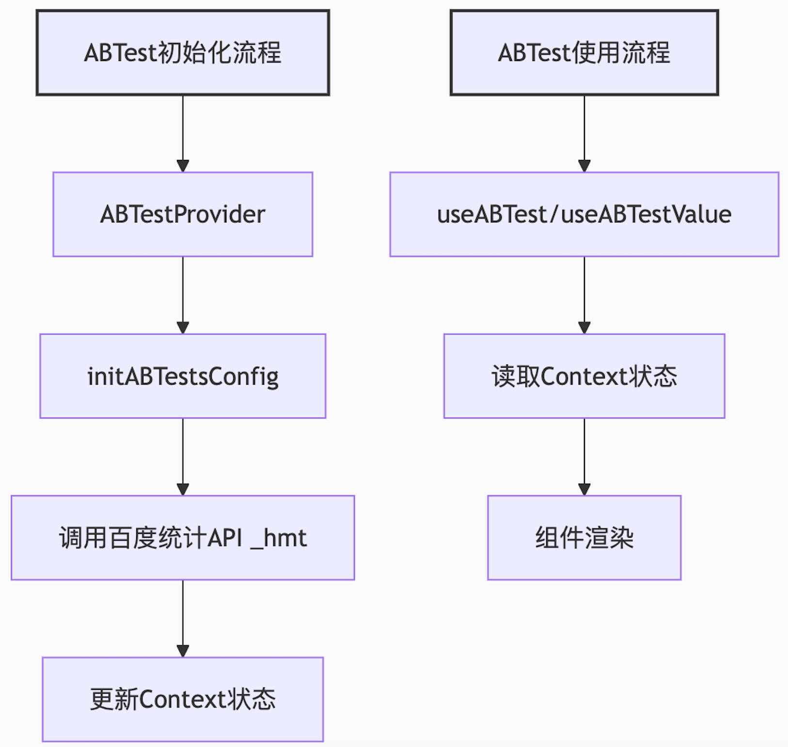

# ABTest Kit

[](https://github.com/sunny-117/abtest-kit/actions/workflows/unit-test.yml)
[![npm version][npm-version-src]][npm-version-href]
[![npm downloads][npm-downloads-src]][npm-downloads-href]
[![bundle][bundle-src]][bundle-href]
[![JSDocs][jsdocs-src]][jsdocs-href]
[![License][license-src]][license-href]

[English](./README.en.md)

## 简介

🔧 轻量级 A/B 测试 SDK，支持多种分流策略和可选的 React 集成，基于 [robuild](https://github.com/Sunny-117/robuild) 构建，仅 2.2 kb

**核心特性：**

- 🚀 **无依赖核心**：纯 JavaScript 实现，可独立使用
- ⚛️ **可选 React 集成**：提供 Hooks 和 Context API
- 🎯 **多种分流策略**：Random、CRC32、自定义函数
- 💾 **持久化存储**：基于 localStorage 的分流结果缓存
- 🔧 **灵活配置**：支持百度统计或完全自定义
- 📊 **增量更新**：智能的配置变更检测和重新分流
- 🐛 **调试友好**：URL 参数强制命中、可控日志输出
- ✅ **高测试覆盖率**：核心逻辑 100% 覆盖，整体 94%+ 覆盖率

## 安装

```bash
npm install abtest-kit
# 或
pnpm add abtest-kit
# 或
yarn add abtest-kit
```

**可选依赖：**

- React 18+ (仅在使用 React 集成时需要)

## 快速开始

### 方式一：独立使用（无需 React）

适用于任何 JavaScript 项目，在页面加载时进行分流：

```javascript
import { initGlobalABTest, getGlobalABTestValue } from 'abtest-kit';

// 定义分流配置
const config = {
  newFeature: {
    key: 'new_feature',
    groups: {
      0: 50,  // 对照组 50%
      1: 50   // 实验组 50%
    }
  }
};

// 初始化分流（结果会自动缓存到 localStorage）
const result = initGlobalABTest(config);

// 在任何地方获取分流值
const featureValue = getGlobalABTestValue('newFeature');

if (featureValue === 1) {
  // 显示新功能
} else {
  // 显示旧功能
}
```

### 方式二：React 集成

适用于 React 应用，提供响应式的分流状态：

```tsx
import { ABTestProvider, useABTestValue } from 'abtest-kit';

const abTestConfig = {
  featureA: {
    key: 'feature_a',
    value: -1,
    groups: { 0: 50, 1: 50 },
    strategy: 'random'
  }
};

function App() {
  return (
    <ABTestProvider abTestConfig={abTestConfig}>
      <YourComponent />
    </ABTestProvider>
  );
}

function YourComponent() {
  const featureValue = useABTestValue('featureA');

  return (
    <div>
      {featureValue === 1 ? '新功能' : '旧功能'}
    </div>
  );
}
```

## 核心 API

### 独立使用 API

#### `initGlobalABTest(config, options?)`

初始化全局分流，结果会缓存到 localStorage。

```typescript
const result = initGlobalABTest(
  {
    test1: {
      key: 'test1',
      groups: { 0: 50, 1: 50 }
    }
  },
  {
    strategy: 'random',  // 'random' | 'crc32' | 自定义函数
    userId: 'user123',   // crc32 策略需要
    storageKey: '__abtest__'  // 自定义存储键
  }
);
```

#### `getGlobalABTestValue(testName, storageKey?)`

获取指定测试的分流值。

```typescript
const value = getGlobalABTestValue('test1');  // 返回 0 或 1 或 -1（未初始化）
```

#### `getGlobalABTestUserstat(storageKey?)`

获取所有分流结果的统计字符串。

```typescript
const userstat = getGlobalABTestUserstat();  // "test_1-0;test_2-1"
```

#### `resetGlobalABTest(config, options?)`

清除缓存并重新分流。

```typescript
const newResult = resetGlobalABTest(config);
```

### React API

#### `<ABTestProvider>`

React 上下文提供者。

```tsx
<ABTestProvider
  abTestConfig={config}
  options={{ userId: 'user123' }}
  injectScript={() => {
    // 可选：注入百度统计脚本
  }}
>
  <App />
</ABTestProvider>
```

#### `useABTest()`

获取完整的 AB 测试上下文。

```tsx
const { abTestConfig, pending, userstat } = useABTest();
```

#### `useABTestValue(testName)`

获取特定测试的值。

```tsx
const value = useABTestValue('test1');
```


## 分流策略

### Random 策略（默认）

完全随机分流，每次初始化时随机分配。

```javascript
initGlobalABTest(config, { strategy: 'random' });
```

### CRC32 策略

基于用户 ID 的确定性分流，同一用户始终分配到相同组。

```javascript
initGlobalABTest(config, {
  strategy: 'crc32',
  userId: 'user_12345'
});
```

### 自定义策略

传入自定义函数实现特定分流逻辑。

```javascript
// 全局自定义策略
initGlobalABTest(config, {
  strategy: (groups) => {
    // 基于时间的分流
    const hour = new Date().getHours();
    return hour % 2 === 0 ? 0 : 1;
  }
});

// 单个实验自定义策略
const config = {
  test1: {
    key: 'test1',
    groups: { 0: 50, 1: 50 },
    strategy: (groups) => {
      // 只对这个实验生效
      return Math.random() > 0.7 ? 1 : 0;
    }
  }
};
```

### 百度统计策略

与百度统计 A/B 测试平台集成（需要在 React 中使用）。

```tsx
<ABTestProvider
  abTestConfig={{
    test1: {
      key: 'test1',
      value: -1,
      strategy: 'baiduTongji'
    }
  }}
  injectScript={() => {
    const script = document.createElement('script');
    script.src = '//hm.baidu.com/hm.js?YOUR_SITE_ID';
    document.head.appendChild(script);
  }}
>
  <App />
</ABTestProvider>
```


## 数据流


## 高级功能

### 全局分流 API

全局分流功能允许在页面加载初期自动进行分流，无需依赖React和Provider。分流结果存储在localStorage中，一旦保存就永久保留，确保用户的分流一致性。

**核心特性：**
- ✅ 无React依赖，纯JavaScript实现
- ✅ 第一次调用时执行分流，后续直接读取缓存
- ✅ 分流结果永久保留，用户不会因为刷新页面而改变分流组
- ✅ 支持Random（默认）和CRC32两种策略
- ✅ 开发者可以通过resetGlobalABTest()主动重新分流

#### 基本使用

```javascript
import { initGlobalABTest, getGlobalABTestValue } from 'abtest-kit';

// 定义全局分流配置
const globalABTestConfig = {
  cardRecommendation: {
    key: 'card_recommendation',
    groups: {
      0: 50,  // 对照组 50%
      1: 50   // 实验组 50%
    }
  },
  newFeature: {
    key: 'newFeature',
    groups: {
      0: 50,  // 对照组 50%
      1: 50   // 实验组 50%
    },
    // 单个实验的自定义分流策略（可选）
    strategy: (groups) => {
      // 基于日期的分流示例
      const day = new Date().getDate();
      return day % 2 === 0 ? 0 : 1;
    }
  }
}

// 在页面加载初期初始化全局分流
const result = initGlobalABTest(globalABTestConfig);
console.log(result); // { cardRecommendation: 1, newFeature: 0 }

// 在任何地方获取分流值
const cardTestValue = getGlobalABTestValue('cardRecommendation');
console.log(cardTestValue); // 1
```

#### 使用CRC32策略

```javascript
const result = initGlobalABTest(globalABTestConfig, {
  strategy: 'crc32',
  userId: 'user_123456'
});
```

#### 使用自定义分流策略

```javascript
// 全局自定义策略
const myCustomStrategy = (groups) => {
  const today = new Date().getDate();
  return today % 2 === 0 ? 0 : 1;
};

const result = initGlobalABTest(globalABTestConfig, {
  strategy: myCustomStrategy
});

// 单个实验自定义策略
const globalABTestConfig = {
  experimentA: {
    key: 'experimentA',
    groups: { 0: 50, 1: 50 }
  },
  experimentB: {
    key: 'experimentB',
    groups: { 0: 50, 1: 50 },
    strategy: (groups) => {
      const hour = new Date().getHours();
      return hour % 2 === 0 ? 0 : 1;
    }
  }
};
```

#### 获取统计字符串

```javascript
import { getGlobalABTestUserstat } from 'abtest-kit';

// 初始化后获取userstat
const userstat = getGlobalABTestUserstat();
// "card_recommendation-0;newFeature-1"

// 上报统计
window.$abtestUserstat = userstat;
```

#### 重置分流

```javascript
import { resetGlobalABTest, clearGlobalABTestCache } from 'abtest-kit';

// 清除缓存并重新分流
const newResult = resetGlobalABTest(globalABTestConfig);

// 或仅清除缓存
clearGlobalABTestCache();
```

## 注意事项

1. React API 的默认分流策略是基于百度统计，所以确保在使用SDK前已正确配置百度统计实验分流
2. 初始化是异步的，使用`useABTestValue`时需要考虑`pending`状态
3. 全局分流使用localStorage存储，请确保浏览器支持localStorage
4. 全局分流结果一旦保存就永久保留，除非主动调用 `resetGlobalABTest()` 或 `clearGlobalABTestCache()`
5. 配置变更（包括流量比例调整）会导致重新分流，请谨慎修改配置

## 最佳实践

1. 将A/B测试配置集中管理
2. 使用TypeScript定义配置类型
3. 合理使用强制测试模式进行开发调试
4. 全局分流应在页面加载初期调用，以确保分流的一致性
5. 为不同的测试使用不同的storageKey，避免冲突

# 其他资料

https://zhuanlan.zhihu.com/p/571901803


## License

💛 [MIT](./LICENSE) License © [Sunny-117](https://github.com/Sunny-117)
<!-- Badges -->

[npm-version-src]: https://img.shields.io/npm/v/abtest-kit?style=flat&colorA=080f12&colorB=1fa669
[npm-version-href]: https://npmjs.com/package/abtest-kit
[npm-downloads-src]: https://img.shields.io/npm/dm/abtest-kit?style=flat&colorA=080f12&colorB=1fa669
[npm-downloads-href]: https://npmjs.com/package/abtest-kit
[bundle-src]: https://img.shields.io/bundlephobia/minzip/abtest-kit?style=flat&colorA=080f12&colorB=1fa669&label=minzip
[bundle-href]: https://bundlephobia.com/result?p=abtest-kit
[license-src]: https://img.shields.io/github/license/Sunny-117/abtest-kit.svg?style=flat&colorA=080f12&colorB=1fa669
[license-href]: https://github.com/Sunny-117/abtest-kit/blob/main/LICENSE
[jsdocs-src]: https://img.shields.io/badge/jsdocs-reference-080f12?style=flat&colorA=080f12&colorB=1fa669
[jsdocs-href]: https://www.jsdocs.io/package/abtest-kit
